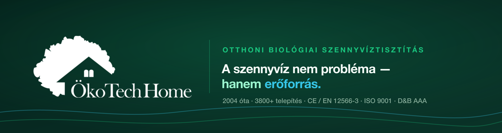

  

<h1 align="center">Változásnapló — okotechhome-web2 <em>(Test2)</em></h1>

  
  
  
  

---

A napló formátuma a [Keep a Changelog 1.1.0](https://keepachangelog.com/hu/1.1.0/) ajánlást követi,
a verziószámozás a [Szemantikus Verziózás 2.0.0](https://semver.org/lang/hu/) szabályait —
**feltöltött írásmóddal** (`MINOR` és `PATCH` két számjegyen). A projektre szabott értelmezést
lásd: [`VERSIONING.md`](./VERSIONING.md).

**Hatókör:** ez a napló az `okotechhome-web2` repó (Test2 munkaterület) teljes történetét fedi le
az inicializálástól kezdve, **tételesen, commitonként**. A Test1 (`okotechhome-web`) története
külön naplóban él, és a két verzió-idővonal **független**.

**Kategóriák:** `Hozzáadva` · `Módosítva` · `Javítva` · `Eltávolítva` · `Elavult` · `Biztonság`

**Jelölések:** `§` = a főoldal szekciója · `OFC` = AI ajánlat-összehasonlító (offer comparison) ·
`AIDT` = AI döntéstámogató · a `( )` zárójelben álló hét karakteres kód a commit rövid hash-e.

---

## [Kiadatlan]

A főoldal fejléce és 1–5. szekciója, a hozzájuk tartozó designrendszer-implementációval.
Kiadásra kész — `./scripts/release.sh 0.02.00` (előtte ezt a szekciót át kell nevezni
`## [0.02.00] — ÉÉÉÉ-HH-NN` alakra).

### Hozzáadva

- **Előkészítés → Telekalkalmasság hub — a brief szerinti kilenc aloldal**, plusz a
  szakasz áttekintő oldala (`projekt-elokeszites/`). Áttekintés · Talaj és
  szivárgóképesség · Talajvíz · Kút és védőtávolság · Telekméret és szabad terület ·
  Lejtés és csőmélység · Járműterhelés és hozzáférés · Adatgyűjtés · Telek- és
  vízelhelyezési előszűrő. A hub három ponton **felülírja** a korábbi
  kommunikációt: az „elég, ha tudja a telek adatait" helyett adatminőségi feltétel
  (becsült / dokumentált / mért) áll; a tartály telepíthetősége és a víz
  elhelyezhetősége **külön** döntés, sőt a második maga is kettéválik műszaki és jogi
  kérdésre; az eredmény pedig nem igen-nem, hanem négy állapot — standard, feltételes,
  vizsgálandó, jelenleg nem igazolt.
- **`.compare-table-start` — adattábla-variáns.** Az alaptábla oszlopokat vet össze,
  ezért középre zár; ez a változat sorokat sorol fel (adat, forrás, minőség), ahol a
  középre zárás olvashatatlan. `.compare-group` a témakörönkénti csoportfejléc-sor.

- **Kapcsolat — elérhetőségi kártya a térkép fölött.** A korábbi két blokk (szöveges
  „Elérhetőség és megközelítés" szekció, alatta a térképsáv) egyetlen sávvá vonva:
  a Google Térkép a teljes szélességű háttér, az adatok egy lebegő kártyán ülnek
  fölötte a bal oldalon. A rétegezés griddel megy — mindkét réteg ugyanabba a cellába
  kerül —, ezért a sáv magassága a magasabbhoz igazodik: nagyobb betűméretnél a
  kártya nem lóg ki, a térkép nő vele. Mobilon nincs átfedés, a kettő egymás alá áll.
- **Saját térképjelölés a cég logójával** — csücskös doboz a Google gombostűje fölött.
  A helye kiszámított, nem szemre igazított: a beágyazás középpontja (`ll=`) 0,00279
  fokkal nyugatabbra van a jelölőnél (`q=`), így a gombostű a sáv közepétől jobbra
  áll, el a bal oldali kártyától — a jelölés CSS-eltolása ugyanezt a **mért** 122
  képpontot követi (a képlet 130-at adna; a keret nem a `z=16` névleges léptékén
  rajzol).
- **Élő térkép a Maps JavaScript API-val — kulcsra várva.** Ha a `.terkep` elem
  `data-terkep-kulcs` attribútuma ki van töltve, a beágyazott keret helyére valódi
  térkép kerül, és a logós jelölés **valódi térképjelölővé** válik: koordinátához
  kötve, `OverlayView`-n keresztül, a térképpel együtt mozogva — húzás és nagyítás
  közben is a házon marad. A színezést ilyenkor nem CSS-szűrő adja, hanem a Google
  saját stílusrétege, és az értékek a designtokenekből olvasódnak ki, így a térkép a
  világos/sötét témával együtt vált. **Üres kulcsnál minden a régi módon működik** —
  a kulcs hiánya, rossz kulcs és hálózati hiba egyaránt a beágyazott keretre esik
  vissza, üres folt nem keletkezik. A `.htaccess` a Maps forrásait külön blokkban,
  kizárólag a `kapcsolat.html`-re engedi. Beállítás és a kulcs korlátozása:
  `_web/README.md`.
- **`terkep.js` — a jelölés élettartama (kulcs nélküli módban).** A réteg csak addig mutat a cégre, amíg a
  térkép áll, mozgásáról viszont — másik eredet lévén — a lap semmit nem tud. Ezért
  nem követjük, hanem visszavonjuk: az egér alatt elhalványul (CSS, JS nélkül is), és
  ha a látogató tényleg a térképpel foglalkozott — 700 ms-nél tovább időzött fölötte,
  vagy a keret fókuszt kapott —, a szkript végleg elveszi. A pontos helyet onnantól a
  Google saját gombostűje jelöli, ami együtt mozog a térképpel. A tévedés ára
  aszimmetrikus: a fölöslegesen elvett jelölés csak egy hiányzó dísz, a bent maradó
  viszont rossz helyre mutatna.
- **`--shadow-3` — harmadik elevációs szint.** A lapról leváló, más tartalom fölött
  lebegő felületekhez. Egyetlen használati helye a térkép fölötti kártya és jelölés:
  ott a háttér nem egyszínű, hanem rajzos, és a `--shadow-2` finom pereme beleolvadt.

- **„Telekvásárlás vagy új építés" hub — öt aloldal.** Alkalmas lehet-e a telek? ·
  Talaj, talajvíz és vízelhelyezés · Milyen dokumentumokra lehet szükség? ·
  Telekadat-ellenőrzőlista · Helyszíni felmérés.
  **A brief három ponton kifejezetten felülír korábbi állításokat, és mindhármat
  átvezettem:** (1) a „nem feltétlenül szükséges helyszíni felmérés — elég, ha
  tudja a telek adatait" helyére döntési tábla került (mikor elég dokumentum és
  fotó, mikor indokolt a kiszállás, mikor kell más szakértő); (2) a tartály
  telepíthetősége és a kezelt víz elhelyezhetősége **két külön döntés** — a régi
  tartalom ezt egybemosta, pedig a magasabb talajvíznél rögzíthető tartályból nem
  következik, hogy a víz helyben szikkasztható; (3) a felmérés eredménye nem
  „személyre szabott ajánlat", hanem strukturált telekbrief.
  Szolgáltatási ár sehol nincs, a felmérésé sem. Az ellenőrzőlista **nem kér
  kapcsolati adatot** a használatához, és minden tételnél elfogadja a „nem tudom"
  választ. A dokumentumoldal szerepkör szerint oszt (építtető / tervező /
  ÖkoTech / hatóság), és kimondja, hogy univerzális dokumentumlista nincs.
- **„Nincs elérhető közcsatorna" hub — a sitemap szerinti négy aloldal.**
  Milyen megoldási lehetőségek vannak? · Közcsatorna vagy egyedi rendszer? ·
  Milyen adatokat kell először összegyűjteni? · Projektindító. A hub-oldal
  döntési útvonalként köti össze őket, mert a sorrend nem tetszőleges: a
  közcsatornahelyzet tisztázása megelőzi a technológiaválasztást.
  **A brief négy szabálya végig érvényes:** nincs konkrét ár (a régi oldal havi
  költség- és megtérülési számai NEM kerültek át); a **„nem tudom" érvényes
  válasz** — az adatlap minden tételénél szerepel, honnan tudható meg, becsülhető-e
  vagy mérni kell; **az ajánlatkérés nem minden oldal végpontja** (legitim
  eredmény a további adatgyűjtés, a telekellenőrzés vagy más megoldás); és a
  **„Közcsatorna vagy egyedi rendszer?" a hub leggyorsabban avuló oldala** —
  jogi jelöléssel és azzal a kiírt kikötéssel, hogy a saját ingatlanra vonatkozó
  választ a víziközmű-szolgáltatótól és az önkormányzattól kell megkérni.
- **Megoldások hub — a sitemap szerinti négy döntéstámogató aloldal.**
  Megoldástípusok összehasonlítása · Melyik megoldás mikor megfelelő? · Kizáró és
  korlátozó feltételek · Megoldástípus-előszűrő. Bekötve a megamenübe (a
  Megoldások panel most nyolc elemű, 4+4 elrendezésben).
  **Két szabály végig érvényes, a tartalmi brief előírása szerint:**
  nincs „jobb–rosszabb" minősítés — a technológiák feltételekkel és
  kompromisszumokkal írhatók le, mert a cél nem az A.B. Clear mindenáron való
  kiválasztása, hanem a rossz technológiaválasztás megelőzése; és **nincs
  kitalált adat** — ahol a brief belső ÖkoTech-adatot ír elő (karbantartási
  ciklus, kizárási mátrix, telekigény, ürítési intervallum, energiafogyasztás,
  a teljes döntési fa), ott `ADATHIÁNY` jelölés áll, nem becslés. A jogszabályra
  hivatkozó állítások `JOGI ELLENŐRZÉS` jelölést kaptak, mert a brief publikálás
  előtti friss ellenőrzést ír elő. Konkrét ár sehol nincs, csak költségkategória.
  Az előszűrő felülete szándékosan még nem él: a döntési szabályokat a cég
  szakmai vezetésének kell jóváhagynia, mielőtt bárkinek eredményt mutatunk.
- **§12 — Dokumentált projektek és használói tapasztalatok**, és a hozzá tartozó
  **négy esettanulmány-oldal** (`eredmenyek/csikvand`, `bakonypeterd`,
  `diosbereny`, `obudavar`). Kiemelt projekt + hármas rács, mindegyik saját
  légifelvétellel, projektadat-táblával és „miért így oldottuk meg" magyarázattal.
  A számok és évszámok a végleges szövegdokumentumból valók, kerekítés nélkül.
  A nyolc visszajelzés léptethető, de **JS nélkül mind látszik** — a `hidden`
  attribútumot a JS teszi rá, tehát a tartalom sosem vész el, és a keresők is
  megtalálják. Nincs automatikus léptetés: a mozgó szöveg olvasás közben zavaró,
  és a WCAG 2.2 külön kéri a megállíthatóságot.
- **Levélküldő backend — három végpont.** `api/kapcsolat`, `api/dontestamogato`
  és `api/ajanlat-atnezes` (ez utóbbi csatolmánnyal). Saját, függőség nélküli
  SMTP-kliens (implicit TLS 465 és STARTTLS 587); a `mail()` azért nem jó, mert
  hitelesítés nélkül adja át a levelet, és SPF/DKIM nélkül spambe kerül.
  **Márkás HTML levélsablon**: sötét fejlécsáv a logóval, táblázatos elrendezés
  (az e-mail-kliensek nem tudnak flexboxot), minden szabály `style` attribútumban
  (a Gmail a `<style>`-t kiszűrheti), és mindig megy sima szöveges változat is.
  A kép blokkolása esetén a fejléc olvasható marad.
  **Négy védelmi réteg**: origin-ellenőrzés, mézesbödön mező, kitöltési idő,
  IP-alapú sebességkorlát. Minden felhasználói érték CR/LF-szűrésen megy át —
  enélkül a `Bcc:` beszúrható lenne, és az űrlap spamtovábbítóvá válna.
  A csatolmány kiterjesztés ÉS tényleges tartalom szerint is ellenőrzött.
  **A jelszó nincs a repóban**: `api/config.php` gitignore-olt, a repóban csak
  a minta van; az `api/.htaccess` a kiszolgálását is tiltja.
- **Kapcsolat oldal — valódi űrlap.** A korábbi „még nem éles" panel helyett
  működő űrlap, amely **JS nélkül is beküld** (sima POST); az `urlap.js` csak a
  választ jeleníti meg helyben, és a hibás mezőre ugrik.
- **§11 — AI ajánlat-összehasonlító.** A Test1-beli modul átvéve: három feltöltő
  kártya (A/B/C) behúzással és tallózással, formátum- és méretellenőrzéssel,
  fájlchippel és visszaállítással; háromlépéses jelző; tízsoros összehasonlító
  tábla, amely üresen indul, és csak a ténylegesen feltöltött ajánlatok oszlopát
  tölti ki. Viselkedés és elrendezés változatlan, a megjelenés a Test2
  tokenkészletéből.
  **Két eltérés a forrástól, mindkettő szándékos:** a megszólítás magázóra
  váltott (a webhely többi része, a 8. szekció modulja is az), és a kitöltés
  után a modul kiírja, hogy **mintaadatot** mutat — a feltöltött fájlok
  kiolvasása backendet igényel, ami még nincs. Enélkül a felhasználó a saját
  ajánlatai elemzésének hinné a táblát. A JS-horgok `data-ofc-*` attribútumok,
  nem osztályok, mert az osztály stílust sugallna.
  Forrás: `assets/js/ofc.js`, `scripts/oldalgyartas/szekcio11.py`.
- **§10 — Tudástár.** Hét témakör-belépő: egy kiemelt (a leggyakoribb elakadási
  pont) és hat a hármas rácsban, mindegyik „Pl. …" ízelítővel a témakör
  hatóköréről. A címek aláhúzottak — ez a dokumentált kivétel a webhely
  aláhúzás-mentes hivatkozásai alól: a szekció szinte csupa link, és a szín
  önmagában nem különböztetné meg őket (WCAG 1.4.1).
- **§9 — Üzemeltetés és hosszú távú költség.** Három technológia éves üzemeltetési
  tételei egymás mellett (zárt tároló · oldómedence · A.B. Clear), saját metszeti
  fényképpel. A számok a végleges szövegdokumentumból valók, nem becslésből —
  a számítás feltevései (háromfős háztartás, napi 135 l/fő, piaci átlagdíjak)
  lábjegyzetben, vonallal elválasztva, mert nem a tartalom folytatása, hanem a
  fenti számok érvényességi köre. Két új variáns: `.situation-grid[data-cols="3"]`
  és `.situation-media` (teljes fénykép világos keretben — a `.card-media` ezzel
  szemben kivágott illusztrációt tart). Az „Epureco … a technológia aloldalán"
  mondat az oldómedencés oldalra hivatkozik.
- **„Helyzetem" kategória — 8 oldal.** A sitemap első főkategóriája megépült: áttekintő
  (`helyzetem/`) és hét helyzet-oldal (nincs közcsatorna · telekvásárlás és új építés ·
  emésztő kiváltása · nyaraló és szezonális · családi ház · vállalkozás és intézmény ·
  már van rendszerem). A szekciók a sitemap 3. szintjét követik, a szerkezet az
  `okotechhome-oldalgyartas` skill „Helyzet-oldal" sablonját. Minden oldalon saját,
  21:9 arányú generált fejléckép, morzsamenü, GYIK és `BreadcrumbList` + `FAQPage`
  strukturált adat.
- **Kapcsolat oldal (`kapcsolat.html`).** A webhely egyetemes CTA-célpontja; eddig
  minden szekció és aloldal nem létező URL-re mutatott. Négy megszólítás-útvonal a
  sitemap szerint (új érdeklődő · meglévő ügyfél · szakmai partner · sajtó), plusz
  elérhetőségek. A fejléc „Konzultációt kérek" gombja is ide mutat.
- **`.situation-grid[data-cols]` reszponzív felülírása.** Az attribútum-szelektor
  specifikusabb az osztályszelektornál, ezért a média-lekérdezésben lévő
  `.situation-grid{grid-template-columns:…}` nem írta volna felül: tableten és
  mobilon is három oszlop maradt volna, összenyomott képekkel. A töréspontok
  most külön nevesítik a variánst.
- **`.numbered-grid` négyelemű változata.** Pontosan négy kártyánál 2×2 rács
  (`:has(> :nth-child(4):last-child)`), mert a hármas osztás 3+1-re tört, és az árva
  kártya elrendezési hibának látszott.
- **Egyedi hibaoldalak — 404 · 403 · 401 · 500.** Egyetlen relatív útvonal sincs
  bennük (a logó beágyazott SVG), mert a böngésző a relatív útvonalakat a
  *kért* URL-hez oldja fel, nem a hibaoldal helyéhez — `/megoldasok/nincs-ilyen`
  kérésnél a `assets/css/app.css` `/megoldasok/assets/…`-ra mutatna, és szintén 404
  lenne. A stílus ezért a `/assets/css/hiba.css`-ben áll, gyökér-abszolút
  hivatkozással. A `.htaccess` mind a négyet bejegyzi, és `Options -Indexes`-szel
  kikapcsolja a könyvtárlistákat (a tiltás 403-at ad, amit a hibaoldal fog el).
  Forrás: `scripts/oldalgyartas/hibaoldalak.py`.
- **`serve.py` — a teljes biztonságifejléc-készlet.** A helyi kiszolgáló eddig három
  fejlécet küldött, CSP-t nem; így egy egész hibaosztály csak élesben derült ki.
  Mostantól a `.htaccess` CSP-jét, `X-Frame-Options`-át, `Permissions-Policy`-jét és
  a teszt üzemmód `X-Robots-Tag`-jét is küldi.
- **Teljes ikonkészlet.** Eddig **egyetlen favicon sem volt** — minden böngészőfülön
  üres lap-ikon állt. A jelrajzból (a logó Fern-zöld térkép-sziluettje) készült
  `favicon.svg`, `favicon-{16,32,48}.png`, gyökérbeli `favicon.ico`,
  `apple-touch-icon.png` (tömör háttérrel, mert az iOS nem kezeli az alfát),
  `icon-{192,512}.png`, maskable változat és `site.webmanifest`. Bekötve mind a
  15 oldalra, `theme-color`-ral együtt.
- **Oldalgenerátorok a repóban** (`scripts/oldalgyartas/`): `sablon.py` a szekció- és
  oldalváz-építőkkel, `helyzetem.py`, `kapcsolat.py`, `hibaoldalak.py`. A fejlécet a
  sablon egy meglévő aloldalból emeli ki, így a 15 példányban duplikált fejléc nem tud
  szétcsúszni, amíg nincs valódi build-lépés.

### Módosítva

- **A hivatkozások alapállapotban nem aláhúzottak** (`a{text-decoration:none}`), egérrel
  és billentyűzet-fókuszban igen. A böngésző alapértelmezett aláhúzása vastag, a
  betűtalpakat elvágó vonal, ami a felületen — ahol a linkek jellemzően külön sorban
  álló adatok — zajnak látszott. A `:hover`/`:focus-visible` aláhúzás nem díszítés:
  ez az egyetlen nem-szín alapú jelzés, ami a hivatkozást hivatkozásként azonosítja.
  A **folyószövegbe ágyazott** linkeknél ez nyitott WCAG 1.4.1 pont — a linkszín és a
  törzsszöveg kontrasztja 2,49:1, a 3:1 alatt. Részletek és a visszakapcsolás egyetlen
  szabálya: `_web/README.md`.
- **A beágyazott térkép tompított és márkaszínű fátylat kapott** (`saturate(.72)` +
  a lap zöldjének 30%-os rétege), hogy háttér maradjon, és a fölötte lebegő kártya és
  logó elváljon tőle. A fátyol maszkja az alsó sávot kihagyja: ott fut a Google logója
  és a térképadat-jelzés, azokat sem fadelni, sem befátyolozni nem szabad.
- **A Google saját adatlapja eltűnt a térkép bal felső sarkából.** URL-paraméterrel nem
  kapcsolható ki, ezért a keret 120px-szel feljebb nyúlik és a sávból kivágódik. Az
  alsó él a helyén marad, így az attribúció végig látszik.

### Javítva

- **A kapcsolat oldalról hiányzott a lábléc.** A `lablec.py` a `\n<script src=` minta
  elé szúrta be a láblécet; ezen az oldalon az utolsó elem egy beágyazott JSON-LD blokk,
  amiben nincs `src=`, így a beszúrás NÉMÁN elmaradt — a szkript mégis sikeresnek
  jelentette. Új tartalék a `</body>` elé, és aki így sem kap láblécet, arról a szkript
  most nevesítve szól.
- **A főoldal 3. szekciójának hivatkozásai** nem létező, a sitemap-en kívüli szlugokra
  mutattak (`uj-epitkezes`, `emeszto-kivaltasa`, `idoszakos-hasznalat`, `telekvasarlas`).
  Mind a négy a megfelelő `helyzetem/…` oldalra mutat. Az első oszlop
  („Építkezés csatorna nélküli telken") a közcsatorna-oldalra került, mert a
  telekvásárlásra a negyedik oszlop mutat.
- **`megoldasok/megoldasok-attekintese`** — a megamenü olyan szlugra hivatkozott, amely
  soha nem létezett; az áttekintő oldal maga a `megoldasok/`. Javítva 13 fájlban.
- **Sötét panelen a prózában álló hivatkozás** a `--link` kékjét kapta, ami a Forest
  háttéren nem éri el a 4,5:1-et. A `.panel-dark-text a` mostantól ugyanazt a
  `--panel-dark-link` színt használja, mint a `.text-link`.
- **Nyolc fejléckép függőleges varrattal.** A képgeneráló promptban a „bal harmad
  üresen marad a szövegnek" megfogalmazás miatt a modell a bal harmadot külön, lapos
  panelként rajzolta, éles illesztéssel — a legfeltűnőbb az *Oldómedencés rendszer*
  oldalon volt. Mind a nyolc újragenerálva egyetlen összefüggő jelenetként; a
  hibás promptszerkezet és a varrat gépi kimutatása a `okotechhome-oldalgyartas`
  skill `designrendszer.md` fájljában rögzítve, hogy ne ismétlődjön.
- **Logó SVG megtisztítva.** A CorelDRAW-export külső DTD-hivatkozást (egyes elemzők
  hálózatról töltenék be), fix `width="3576px"`/`height` attribútumot (CSS-hiba esetén
  ekkorán rajzolódna) és holt névtereket tartalmazott. 10 771 → 10 349 byte, `<title>`
  hozzáadva a közvetlen megnyitáshoz.
- **Teszt üzemmód — keresők teljes kizárása.** Az oldal a `tst.okoth.hu` aldomainre
  költözik; a zárás három rétegben él: `X-Robots-Tag` fejléc a `.htaccess`-ben,
  `Disallow: /` a `robots.txt`-ben, és `<meta name="robots" content="noindex, …">`
  minden oldalon. A HTTP Basic Auth blokk előkészítve, kommentben. Az élesítési
  ellenőrzőlista a `_web/README.md` elején.
- **Domain átállítás:** a `canonical` és az Open Graph URL-ek `okotechhome.hu` helyett
  már az éles **`okoth.hu`** domainre mutatnak, így élesítéskor nem kell hozzájuk nyúlni.
- **Hero videó erőforrás-kezelése.** A hurokban futó felvétel `IntersectionObserver`-rel
  és `visibilitychange`-dzsel megáll, amikor kigörög a képből vagy a lap háttérbe kerül —
  enélkül a folyamatos dekódolás hosszú munkamenetben lassuláshoz, végül a lap
  összeomlásához vezetett. A videó újrakódolva takarékosabbra: 1600→1280px,
  3026→1515 kbps, 2,5→1,27 MB.
- **`serve.py` — részleges letöltés (HTTP 206).** A beépített kiszolgáló minden kérésre a
  teljes fájlt küldte, ezért a hurokvideó újra és újra letöltődött. Élesben az Apache ezt
  magától megoldja; ez a helyi kiszolgálót hozza szintre.

- **Megamenü a fejlécben** — a sitemap 2. szintje (39 aloldal öt kategóriában) lenyíló
  panelekből érhető el. A nyitóelem `button` (`aria-expanded` + `aria-controls`), a panel
  `hidden`-nel zár, Esc és külső kattintás bezárja, a fókusz visszatér. A navigáció a
  sitemap nyolc főkategóriájára épült át: öt a fejlécben panellel, három a kontaktsávban.
- **`index.html` — oldalfejléc**: kontaktsáv (cím, e-mail, telefon · GYIK, Karrier) és fő
  navigációs sáv (logó, ötelemű menü, „Konzultációt kérek" CTA). A menü natív
  `details`/`summary`: a markupban nyitva áll, ezért JS nélkül is elérhető; ≤1024px-en
  lenyitható panellé válik.
- **`index.html` — 1. szekció (*Hero*)**: adatsor, kiemeléses főcím, bevezető, két gomb és
  egy chip-hivatkozás az ajánlat-összehasonlításhoz. **Borító-elrendezés**: a felvétel a
  teljes hero-felületet kitölti, a szöveg rajta ül. A magasság a képernyővel mozog —
  legalább `100svh − --header-h`, e fölött a médiablokk aránya vagy a szöveg magassága
  dönt. ≤1024px-en a borító megszűnik: szöveg, alatta a szűk kivágatú kép.
- **Lágy folt (veil) a hero szövege mögött** — radiális gradiens, amely minden irányban a
  nulláig fut ki, ezért sehol nincs éle vagy sávhatára. Középpontja a konténerhez kötött
  (`50% − --container-max/2 + --page-gutter + 26ch`), így a szövegoszlop fölött marad
  minden képernyőszélességen. Csak annyit emel a háttéren, hogy a felvétel kontúrjai ne
  fussanak bele a betűkbe; ≤1024px-en kikapcsolva.

  > ⚠️ A mozgókép változó háttere miatt a WCAG 2.2 AA szövegkontraszt **nem garantálható
  > minden pillanatban**. Jelezve a `COMPONENTS.md` 13. pontjában.
- **Tapadó (sticky) fejléc** finom árnyékkal (`--shadow-1`, sötét témában elmarad):
  a kontaktsáv görgetéskor kicsúszik, a fő sáv a viewport tetején marad. A `top` épp a
  kontaktsáv magasságával negatív — a fő sávot önmagában nem lehet tapasztani, mert a
  `sticky` a szülő dobozán belül mozog.
- **`.btn-inverse`** — a hero második gombja a legsötétebb felületen (Forest), ahogy a
  vizuális terv mutatja; sötét témában a felület-lépcső következő fokán.
- **`index.html` — 2. szekció (*Bizalmi sáv*)**: négy állítás (3 800+ rendszer ·
  EN 12566-3 / CE · Construma Nagydíj 2014 · ISO 9001 / esztergomi gyártás) függőleges
  elválasztókkal; a szabványjelölések mono betűvel, mert adatok.
- **Hero-média** — állókép **két kivágásban** (16:9 asztali, 3:2 szűk) WebP-ben, `picture`
  art directionnel, és a `hero-rendszer.{webm,mp4}` felvétel hang nélkül. A videót
  a `site.js` **csak asztali nézetben, mozgás engedélyezése mellett és adattakarékos mód
  nélkül** tölti be, a `load` esemény után; minden más esetben az állókép a végállapot.
- **`assets/js/site.js`** — az oldal első JS-e (~2 KB, `defer`): menüpanel szűk nézetben,
  feltételes hero videó. Mindkettő progressive enhancement.
- **`index.html` — 8. szekció (*AI-alapú döntéstámogató*)** és **`assets/js/ai-advisor.js`**:
  a Test1 §6 modulja átvéve. A JS (566 sor: kérdéssor, ársáv-logika, eredményképernyő)
  **változatlan**, a ~200 soros `.aidt-*` CSS teljes egészében a Test2 tokenjeire újraírva.
  Lásd `_web/COMPONENTS.md` 18.
- **`assets/data/aidt-konfig.js`** — a döntéstámogató **árértékei a kódon kívülre kerültek**,
  a cég által szerkeszthető konfigba (a modulban csak tartalék marad). Ugyanitt áll az
  adatküldés végpontja és az adatkezelési tájékoztató útvonala.
- **Valódi adatküldés a döntéstámogatóban** — beállított végponttal `POST`, sikeres válasz
  után visszaigazolás, hibánál `role="alert"` üzenet. Végpont nélkül a modul **nem állítja,
  hogy elküldte**, hanem jelzi, hogy a küldés még nincs élesítve. A hozzájárulás mellett
  megjelenik az adatkezelési tájékoztató hivatkozása.
- **`<noscript>` alternatíva a 8. szekcióban** — JS nélkül a szekció elmondja, mit kérdezne
  a modul, és felkínálja a telefonos, illetve e-mailes utat.
- **Hero-felvétel cserélve** az új anyagra (naplementés kert, feltárt munkagödör): WebM
  2,7 MB + MP4 2,8 MB, 1600px szélességben. Az állóképek is **ebből a felvételből** készültek
  (16:9 asztali és 3:2 szűk kivágat), hogy a mobil és az asztali nézet ne térjen el.
  A hero adatsora a másodlagos szövegszínt kapta: a napfényes égen a harmadlagos nem érte el
  a 4,5:1-et.
- **`assets/img/logo-okotechhome.svg`** — az ügyféltől kapott kétszínű logó (Fern jelrajz,
  Forest szóvédjegy), egyetlen kiegészítéssel: a szóvédjegy sötét rendszertémán Stardustra
  vált (`prefers-color-scheme`). A fejlécben `height: var(--space-48)`, `width: auto`.
- **`assets/icon/ui-{helyszin,email,telefon}.svg`** — az ügyféltől kapott kontaktikonok
  `currentColor`-ra állítva; `ui-dokumentum.svg` **ideiglenes saját pótlás**, a terv
  chipjének rajzolata után (álló lap behajtott sarokkal, három sorral, az első rövidebb).
- **`.chip-link`** — kiegészítő, chip megjelenésű hivatkozás. Nem gomb (a 7.1 szerint
  szekciónként egy elsődleges CTA áll) és nem `.card-tag` (az nem interaktív).
- **`.icon-inline` / `.icon-inline-lg`** — soron belüli ikonméret-szerep. Itt a befoglaló
  négyzet a helyes szabály, nem a blokk-ikonok magasság-normalizálása.
- **`--dur-media` (600ms)** — javasolt lassabb időtartam-szerep médiaváltáshoz; a rendszerben
  eddig csak a `--dur-fast` (150ms) élt.
- **`assets/css/app.css`** — a designrendszer (`OTH-design-system-Teszt.v2` v0.5)
  implementációja `@layer` architektúrában: `reset → tokens → base → typography →
  components → responsive → motion`. A tokenblokk szó szerint az élő HTML-referenciából,
  a `.type-*` szereposztályok, a `.btn` és a `.text-link` változatlanul.
- **`index.html` — 3. szekció (*Kiinduló helyzet*)**: négy helyzetoszlop kerek
  ikonjelvénnyel és felső elválasztó vonallal (nem kártya, a canvason), alattuk **sötét
  kiemelt panel** a nagyobb kapacitású (50 fő feletti) igényekhez. A szövegek a végleges
  főoldal-dokumentumból (`Okoteh-Home.fooldal.szoveg-vagleges.docx`).
- **`assets/icon/ui-{epitkezes,emeszto,nyaralo,telek}.svg`** — a helyzetoszlopok
  ikonjai; saját vonalas rajzolat a vizuális terv után, `currentColor`-ral.
- **A döntéstámogató haladás-sínje és ikonjai átdolgozva** — a sín halvány sávon telített
  kitöltés, gyűrű nélküli véggel (a korábbi világos gyűrű elvágta a sínt), a kitöltésnek
  alsó határa van, hogy induláskor is látszódjon. A bizalmi jelvények 32→40px, a rajzolatok
  16→24px: a korábbi méret olvashatatlanul apró volt.
- **`.situation` · `.icon-badge` · `.panel-dark` · `.link-label`** — új komponensek,
  kizárólag meglévő tokenekből. Indoklás: `_web/COMPONENTS.md` 13/b–13/c.
- **`index.html` — 4. szekció (*Technológiák*)**: három sorszámozott magyarázókártya,
  „Gyors összehasonlítás" táblázat ikonos oszlopfejlécekkel, és a saját berendezések
  (Epureco oldómedence, A.B. Clear) blokkja. A technológiai ikonok és a két termékrender
  az ügyfél új eszközeire cserélve (a biológiai ikon 107×41 → 58×41, az `aspect-ratio`
  ehhez igazítva; a termékfotók 1254×1254, alfacsatornás WebP).
- **`index.html` — 5. szekció (*Megoldásaink*)**: négy termékkártya besorolás-címkével
  (A.B. Clear · telepek · Epureco oldómedencék · iszapzsákos technológia).
- **`.card-tag`** — címke-chip a kártya besorolásához. Nem státusz és nem művelet, ezért
  nem `.alert` és nem gomb, hanem önálló, nem interaktív komponens.
- **`.card-media-product`** — médiakeret-variáns álló és négyzetes termékrenderhez;
  a 3:2-es alapkeretben ezek a képek a kártya szélességének alig felét töltenék ki.
- **`.section-lead-wide` + `.br-desktop`** — a bevezető bekezdés a terv szerinti
  sortöréssel, kizárólag asztali nézetben kényszerítve.
- **Új komponensek** — a designrendszer 10. fejezete szerint még definiálatlan elemek
  dokumentált osztályként, kizárólag meglévő tokenekből: szekció-sáv, kártya, médiakeret,
  kiemelt panel, sorszámjelvény, ikon, összehasonlító táblázat, termékkártya,
  kétoszlopos szekcióalj. Indoklás és javasolt szabályzatszöveg: **`_web/COMPONENTS.md`**.
- **`.htaccess`** — kiterjesztés nélküli (clean) URL-ek: `/valami.html` → 301 `/valami`,
  `/index.html` → 301 `/`, záró perjel eltávolítása; biztonsági fejlécek (CSP, nosniff,
  X-Frame-Options, Referrer-Policy, Permissions-Policy), tömörítés és cache. A cache-szabályok
  kiegészítve a `video/webm` és `video/mp4` típusokkal.
- **`serve.py`** — lokális preview szerver, amely a `.htaccess` clean-URL viselkedését
  emulálja. Enélkül a kiterjesztés nélküli linkek helyben 404-et adnának.
- **Médiaeszközök** — öt kivágott illusztráció és két termékfotó WebP-ben
  (`assets/img/`), három technológiai ikon (`assets/icon/`).

### Javítva

- **Médiakeret magassága** — a `.card-media` egyszerre flex-konténer és flex-elem, így az
  alapértelmezett `min-height:auto` a *kép* belső méretéből számolt, és felülírta az
  `aspect-ratio`-t. A hiba csak akkor jelentkezett, ha a kép saját aránya magasabb volt a
  szereptokenben megadottnál — ezért asztali nézetben rejtve maradt, és mobilon jött elő
  (460×306 a várt 460×259 helyett). Javítás: `min-height:0`.
- **Ikonok beégetett színe** — a kapott CorelDRAW-SVG-k `fill:#21432B` nyers hexet
  hordoztak, ami a 9. tiltólistába ütközik és sötét témában olvashatatlan lenne.
  A `fill` `currentColor`-ra cserélve, a színt CSS-maszk adja.
- **Táblázat túlcsordulása** — a négyoszlopos összehasonlító tábla 46px-szel kilógott a
  szekcióalj felén. A cellák vízszintes belső térköze `--space-16` → `--space-8`.
- **Fejléc-ikonok elcsúszása** — alsó cellaigazításnál a kétsoros oszlopfelirat
  („Biológiai szennyvíztisztító") feltolta a saját ikonját, és az ikonsor kiesett a vonalból.
  A fejléccellák `vertical-align: top`-ra állítva.
- **A táblázat harmadik felülete** — a vizuális terv három felületet használ (panel →
  halványabb zöld páratlan sor → fehér páros sor), az implementációban csak kettő volt.
  A középső árnyalatra nincs token, nyers hexet pedig a 0.8 és a 9. szabály tilt, ezért
  `color-mix(in srgb, var(--surface-muted) 60%, var(--surface))` állítja elő — így témaváltáskor
  együtt mozog a két forrásfelülettel.

### Dokumentáció

- **`_web/README.md`** újraírva: designrendszer-összefoglaló (betűcsaládok, paletta, térköz,
  töréspontok), a betartott kötelező szabályok, clean-URL viselkedéstábla, deploy-kizárások.
- **`README.md`** — Test1 ↔ Test2 összevetés kiegészítve a tényleges tipográfiával és
  palettával; a könyvtárfa a valós `_web/` tartalommal; helyi fejlesztés `serve.py`-ra állítva.
- **`VERSIONING.md`** — commit-hatókörök a projekt tényleges moduljaira igazítva,
  verzió-életút frissítve.
- **Jelezve:** a Test1 GSAP + Lenis animációs rétege ütközik a designrendszer **0.7**
  alapszabályával (*„Nincs framework"*), ezért nem emelhető át változtatás nélkül.

### Megjegyzés

- A kártyák **azonos magasságúak** (a rács `stretch` igazítása), a hivatkozás
  `margin-top:auto`-val mindig a kártya alján zár.
- A `_web/` linkjei már **kiterjesztés nélküliek**; a hivatkozott aloldalak
  (`uj-epitkezes`, `emeszto-kivaltasa`, …) még nem léteznek, így helyben 404-et adnak.
  A hero három modul-útvonala (`dontesi-utvonal`, `koltsegiranytu`,
  `ajanlat-osszehasonlitas`) **javasolt szlug**, a döntéstámogató modulok végleges
  elnevezésével együtt véglegesítendő.
- Döntést igénylő pontok a `COMPONENTS.md`-ben jelölve: a navigációs CTA gombként való
  megjelenítése (7.6 tábla), a szekció-sávok váltakozása (5.3 elv), a kontaktsáv
  hivatkozásainak típusa (`.topbar-link` vs `.text-link`), a nagybetűs navigáció
  szerepszintre emelése, az inverz gomb felvétele a 7.1-be, a réteg- (z-index-) skála
  hiánya, valamint a mozgókép rendszerszintű szabályozása.
- **A logó szóvédjegye a `prefers-color-scheme`-et követi**, nem a `[data-theme]`
  kapcsolót — a témaváltó UI megépítésekor inline SVG-re cserélendő. A vektoros mester
  (`okotech-logo-magyar-colorversions.ai`) egyszínű, szeriffes feliratú változatokat
  tartalmaz; a weben az ügyféltől külön kapott **kétszínű, groteszk feliratú** SVG él.
- A hero videója **8 másodperces, néma, hurokban futó** felvétel: WebM 1,4 MB,
  MP4 1,7 MB. Szűk nézetben egyik sem töltődik le.

---

## [0.01.01] — 2026-07-26

A **Test2** repó inicializálása: webkimenet-váz, verziókezelés és dokumentációs réteg.
**Weboldal-kód még nincs** — a `_web/` egyelőre üres váz.

A Test2 azonos márkát, motort, technológiát és logót visz, mint a Test1
(`okotechhome-web`, jelenleg `0.9.0`); az eltérés kizárólag a **designrendszerben** lesz.

### Hozzáadva

- **`_web/`** — a deployolható statikus webkimenet váza (`assets/{css,js,img}`), saját
  `README.md`-vel: célszerkezet, technológiai réteg, helyi kiszolgálás, minőségi kapuk.
- **`README.md`** — HTML-alapú (banner, badge-ek, táblázatok) projektútmutató:
  Test1 ↔ Test2 összevetés, repó-hatókör, verziózás, deploy, nyitott pontok.
- **`CHANGELOG.md`** — ez a napló, Keep a Changelog 1.1.0 formátumban.
- **`VERSIONING.md`** — verziózási szabályzat: a **feltöltött** (`X.YY.ZZ`) verziószám-formátum
  definíciója és indoklása, SemVer-értelmezés statikus marketing-oldalra, Conventional Commits →
  verzióemelés leképezés, ág- és tagkonvenciók, kiadási folyamat, deploy-korreláció,
  visszaállítási (rollback) recept, verzió-életút.
- **`VERSION`** — gépi olvasásra alkalmas, egysoros verzió-forrás (single source of truth): `0.01.01`.
- **`scripts/release.sh`** — kiadás-automatizálás: a feltöltött formátum validációja, numerikus
  (`10#` bázisú, oktális-biztos) verzió-összehasonlítás, `VERSION` frissítés, `CHANGELOG.md`
  szekció-ellenőrzés, annotált tag létrehozása, `--dry-run` móddal.
- **`.gitignore`** — a repó hatókörét kikényszerítő kizárások (lásd alább), valamint titkok,
  rendszerszemét és build-melléktermékek.
- **`.github/banner.png` · `.github/banner.svg`** — README-banner, a Test1 repóból átemelve
  (a márka azonos, a banner nem kerül élesre).

### Repó-hatókör

A távoli repóba **kizárólag a webkimenet és a verziókezelési réteg** kerül. A projekt körüli
belső munkaanyag **szándékosan helyben marad**, és nincs a git-történetben sem:

| Helyi könyvtár | Miért marad ki |
|---|---|
| `_memory/` | belső projektmemória, gépspecifikus — nem a leszállítandó része |
| `_work/` | munkapéldányok, jegyzetek, promptok, nagy médiamentések |
| `_files/` | ügyfél-dokumentumok (ajánlat, stratégia, jogi klauzula) |
| `_OTH_tesztfileok/` | teszt-ajánlatok az OFC modul kipróbálásához |
| `_kepek_videok/` | médiamesterek (434 MB); a git nem bináris-tár |

> Ezek mentése **nem git feladata** — külső meghajtó vagy felhő-tárhely szükséges hozzá.

### Git-történet

- **Friss, tiszta történet.** A könyvtár korábban a Test1 munkaterület másolt `.git`-jét hordozta
  (`de586e6` commit + `v1.0.0` tag, távoli nélkül), ami a Test2 `0.01.01`-es indulásával
  ellentmondásban állt. Az örökölt történet `git bundle`-ként mentve
  (`_work/_backup/okotechhome2-inherited-test1-history.bundle`, helyi), az eredeti pedig
  érintetlenül megvan a `_OkoTechHome/.git`-ben — egyedi adat nem veszett el.
- **Távoli repó bekötve:** `github.com/eSystem-Integration-Kft/okotechhome-web2` (privát),
  fő ág: `main`.
- **Annotált tag:** `v0.01.01`.

---

  Ökotech-Home Kft. · fejlesztő: eSystem-Integration Kft. / IEM — Industrial Electric &amp; Mechanic Kft., Érd

