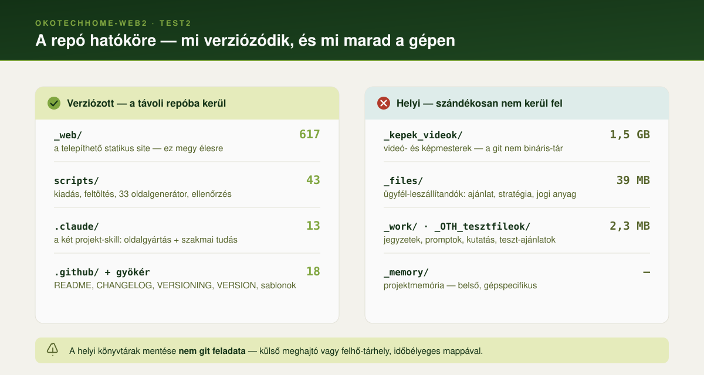
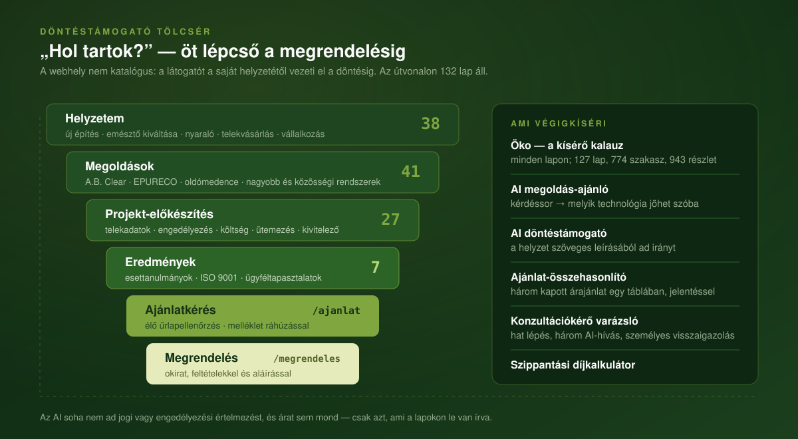
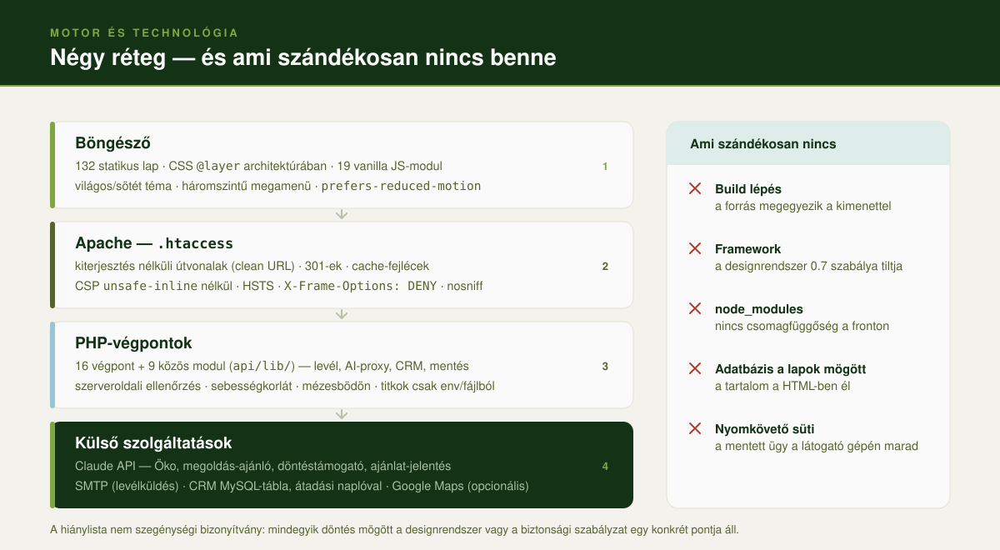
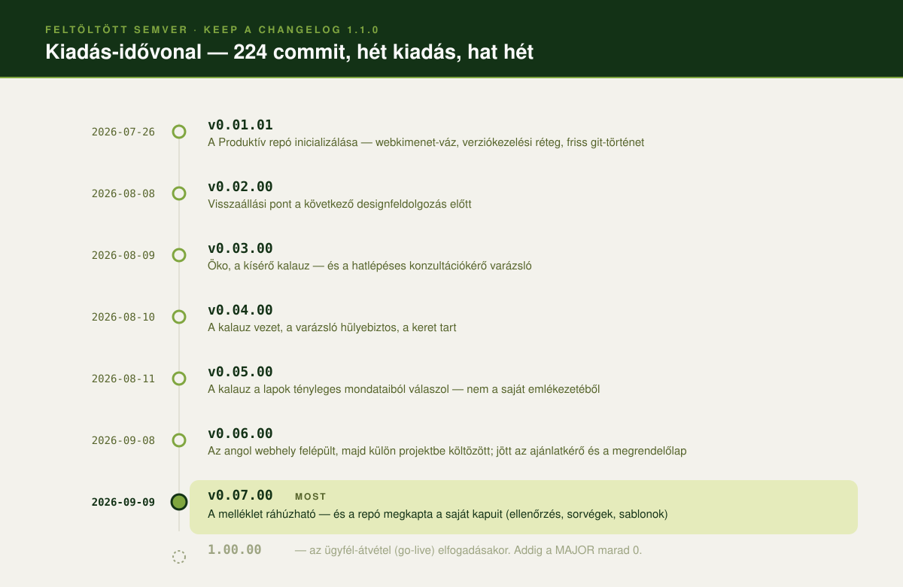

<p align="center">
  
</p>

<h1 align="center">okotechhome-web2 — <em>Test2</em> munkaterület</h1>

<p align="center">
  <strong>Ugyanaz a márka, motor és technológia — új designrendszerrel.</strong><br>
  Az <a href="https://okotechhome.hu">Ökotech-Home Kft.</a> döntéstámogató weboldalának
  második, párhuzamos designváltozata.
</p>

<p align="center">
  
  
  
  
  
  
  
  
</p>

<p align="center">
  <a href="./CHANGELOG.md">Változásnapló</a> ·
  <a href="./VERSIONING.md">Verziózási szabályzat</a> ·
  <a href="./_web/README.md">Webkimenet</a> ·
  <a href="./_web/COMPONENTS.md">Komponensek</a> ·
  <a href="./VERSION">VERSION</a>
</p>

---

## ✨ Mi ez

Ez a repó az **ÖkoTech Home** weboldal **Test2** változatának forráskódja: a telepíthető
webkimenet (`_web/`) és a hozzá tartozó verziókezelési réteg, saját verziószámmal.

A webhely nem katalógus, hanem **döntéstámogató tölcsér**: a látogatót a saját helyzetétől
(*„emésztőt szeretnék kiváltani"*, *„telket veszek"*, *„nyaralóhoz kell"*) vezeti el a
technológiaválasztáson és az előkészítésen át az ajánlatkérésig és a megrendelésig.

<table>
  <tr><td><b>Ügyfél</b></td><td>Ökotech-Home Kft. · Esztergom · 2004 óta · 3800+ telepítés</td></tr>
  <tr><td><b>Fejlesztő</b></td><td>eSystem-Integration Kft. (eSI Kft.), Érd</td></tr>
  <tr><td><b>Távoli repó</b></td><td><code>github.com/eSystem-Integration-Kft/okotechhome-web2</code> (privát)</td></tr>
  <tr><td><b>Teszt</b></td><td><code>https://tst.okoth.hu</code> — keresők elől elzárva</td></tr>
  <tr><td><b>Éles</b></td><td><code>https://okoth.hu</code> — <i>még nincs élesítve</i></td></tr>
  <tr><td><b>Designrendszer</b></td><td><code>OTH-design-system-Teszt.v2</code> <b>v0.5</b> — a HTML-referencia az igazságforrás</td></tr>
  <tr><td><b>Nyelv</b></td><td><code>hu-HU</code> — az angol változat 2026-09-08-án külön projektbe költözött</td></tr>
</table>

### 🔁 Test1 ↔ Test2

<table>
  <tr>
    <th></th>
    <th>Test1 — <code>okotechhome-web</code></th>
    <th>Test2 — <code>okotechhome-web2</code> <i>(ez)</i></th>
  </tr>
  <tr><td><b>Márka / logó</b></td><td colspan="2" align="center">🟰 <b>azonos</b> — ÖkoTech Home</td></tr>
  <tr><td><b>Tartalmi téma</b></td><td colspan="2" align="center">🟰 <b>azonos</b> — otthoni biológiai szennyvíztisztítás, döntéstámogató tölcsér</td></tr>
  <tr><td><b>Alaptechnológia</b></td><td colspan="2" align="center">🟰 <b>azonos</b> — statikus HTML/CSS, vanilla JS, Apache <code>.htaccess</code>, clean URL</td></tr>
  <tr><td><b>Tipográfia</b></td><td>Sora + Inter</td><td>🆕 Zilla Slab + IBM Plex Sans + IBM Plex Mono</td></tr>
  <tr><td><b>Paletta</b></td><td>smaragd / aqua tokenkészlet</td><td>🆕 ÖTH-paletta — Fern · Lime · Olive Leaf · Forest · Sea Mist · Sky Blue</td></tr>
  <tr><td><b>Animációs réteg</b></td><td>GSAP 3.12 + ScrollTrigger + Lenis</td><td>⚠️ <b>nincs</b> — a designrendszer 0.7 szabálya tiltja a frameworköt</td></tr>
  <tr><td><b>Verzió-idővonal</b></td><td colspan="2" align="center">↔️ <b>független</b> — a két repó verziója nem korrelál</td></tr>
</table>

> ⚠️ **A motor mégsem teljesen azonos.** A Test1 GSAP + Lenis stacket használ, a Test2
> designrendszer **0.7 alapszabálya** viszont kimondja: *„Nincs framework. Natív HTML-elem és
> vanilla JS."* A scroll-animációs réteg tehát **nem emelhető át változtatás nélkül** — vagy
> natív CSS scroll-driven animation kell helyette, vagy a designrendszernek kell felmentést
> adnia. Nyitott kérdés, lásd a *Nyitott pontok* szakaszt.

---

## 🗺️ A repó hatóköre

<p align="center">
  
</p>

A hatókör **szándékosan szűk**: a távoli repóba a **webkimenet** és a hozzá tartozó
**dokumentációs / verziókezelési réteg** kerül. A munkakönyvtárak helyben maradnak — nem
azért, mert lényegtelenek, hanem mert nem a leszállítandó részei, és a git nem bináris-tár.

```text
_OkoTechHome2/
│
│  ┌─ ✅ VERZIÓZOTT — github.com/eSystem-Integration-Kft/okotechhome-web2 ─────┐
├─ README.md                  # ez a fájl
├─ CHANGELOG.md               # tételes változásnapló (Keep a Changelog)
├─ VERSIONING.md              # verziózási szabályzat + kiadási folyamat
├─ VERSION                    # 0.07.00 — gépi olvasásra, single source of truth
├─ .gitignore                 # mi marad ki a verziózásból és miért
├─ .gitattributes             # sorvégek, binárisok, `git archive` kizárások
├─ scripts/
│  ├─ release.sh              #   kiadás (VERSION + _web/VERSION + commit + tag)
│  ├─ ellenorzes.sh           #   repó-ellenőrzés — ugyanez fut a CI-ban is
│  ├─ feltoltes.sh            #   FTPS-tükrözés a tárhelyre (alapból csak felsorol)
│  ├─ kalauz-index.py         #   Öko tartalom- és szövegindexének újraépítése
│  ├─ crm-mysql-sema.sql      #   a CRM-tábla, amit az ügyfél DBA-ja futtat
│  └─ oldalgyartas/           #   33 Python-generátor: az ISMÉTLŐDŐ markup egyetlen forrása
│                             #     fejlec.py · lablec.py — MINDEN oldal fejléce/lábléce
│                             #     *_hub.py            — a sitemap szerinti aloldalak
│                             #     sitemap_export.py   — oldaltérkép a menüadatból
│                             #     szoveg_kivonat.py   — a lapok szövege átnézésre
├─ .github/                   # banner, infografikák, PR- és hibasablon, CI-workflow
├─ .claude/skills/            # két projekt-skill (lásd lent)
├─ _web/                      # 🌐 WEBKIMENET — ez megy élesre
│  └───────────────────────────────────────────────────────────────────────────┘
│
│  ┌─ ❌ HELYI — nem kerül a távoli repóba ────────────────────────────────────┐
├─ _memory/                   # 🧠 projektmemória (MEMORY.md index + tényfájlok)
├─ _work/                     # 🛠️ munkapéldányok, jegyzetek, promptok, kutatás
├─ _files/                    # ügyfél-leszállítandók (ajánlat, stratégia, jogi)
├─ _OTH_tesztfileok/          # teszt-ajánlatok az OFC modul kipróbálásához
└─ _kepek_videok/             # médiamesterek (1,5 GB) + ASSET-MANIFEST.md
   └──────────────────────────────────────────────────────────────────────────┘
```

> ⚠️ **A helyi könyvtárak mentése nem git feladata.** Külső meghajtó vagy felhő-tárhely
> (időbélyeges mappa) javasolt — a `_memory/`, `_work/`, `_files/` és `_kepek_videok/`
> tartalma **csak ezen a gépen létezik**. A médiamesterek tételes leltára:
> `_kepek_videok/ASSET-MANIFEST.md`; ha mégis verziózni kell őket, a Git LFS-recept a
> manifest végén található.

---

## 🧭 A webhely — mi épült meg

<p align="center">
  
</p>

| Terület | Útvonal | Lapok | Mi van benne |
|---|---|--:|---|
| **Főoldal** | `/` | 1 | fejléc + mind a **15 szekció** (hero → GYIK) |
| **Helyzetem** | `/helyzetem/` | 38 | új építés · emésztő kiváltása · nyaraló · telekvásárlás · vállalkozás és intézmény |
| **Megoldások** | `/megoldasok/` | 41 | A.B. Clear · EPURECO · oldómedence · nagyobb és közösségi rendszerek |
| **Projekt-előkészítés** | `/projekt-elokeszites/` | 27 | telekadatok · engedélyezés · költség · ütemezés · kivitelező |
| **Eredmények** | `/eredmenyek/` | 7 | esettanulmányok · ISO 9001 · ügyféltapasztalatok |
| **Megkeresés** | `/ajanlat` · `/megrendeles` · `/konzultacio` · `/kapcsolat` | 4 | élő űrlapellenőrzés, melléklet ráhúzással, okirati megrendelőlap |
| **Modulok és jogi** | `/szippantasi-dij-kalkulator` · `/jelentes` · `/eredmeny` · jogi lapok | 14 | díjkalkulátor, ajánlat-jelentés, mentett ügy, ÁSZF és adatkezelés |

**Összesen 132 lap.** A megamenü háromszintű (főmenüpont › hub › aloldal), és a szerkezete
**adatként** él a `scripts/oldalgyartas/fejlec.py`-ban — nem 132 helyen, kézzel.

### AI-modulok

| Modul | Hol | Mit csinál |
|---|---|---|
| **Öko — kísérő kalauz** | minden lapon | a lapok tényleges mondataiból válaszol (**127 lap, 774 szakasz, 943 részlet**); három kódszintű védelem a kitalálás ellen |
| **Megoldás-ajánló** | 6. szekció | kérdéssor → melyik technológia jöhet szóba |
| **Döntéstámogató** | 8. szekció | a helyzet szöveges leírásából ad irányt |
| **Ajánlat-összehasonlító** | 11. szekció | három kapott árajánlat egy táblában, nyomtatható jelentéssel |
| **Konzultációkérő varázsló** | `/konzultacio` | hat lépés, három AI-hívás (kitöltéssegéd, belső brief, személyes visszaigazolás) |
| **Szippantási díjkalkulátor** | `/szippantasi-dij-kalkulator` | egy képlet mindhárom díjszabás-szerkezetre; a díjadatbázis **egyelőre üres**, és ez látszik is |

> Az AI **soha nem ad jogi vagy engedélyezési értelmezést, és árat sem mond** — csak azt,
> ami a lapokon le van írva. Részletek: [`_web/README.md`](./_web/README.md) → *Öko*.

---

## ⚙️ Motor és technológia

<p align="center">
  
</p>

**Nincs build lépés.** A `_web/` fa maga a kimenet: amit a szerkesztőben látsz, az megy ki a
kiszolgálóra. Ezért a cache-busting kézi (`app.css?v=NN`), és ezért fontos, hogy **minden lap
ugyanazt a verziót kérje** — ezt a `scripts/ellenorzes.sh` ellenőrzi.

---

## 🖥️ Helyi fejlesztés

Az oldal **kiterjesztés nélküli** útvonalakat használ (`/uj-epitkezes`), amit élesben a
`.htaccess` rewrite old meg. A sima `python3 -m http.server` ezekre 404-et adna, ezért saját
preview-szerver kell:

```bash
cd _web
python3 serve.py            # http://localhost:8849
python3 serve.py 9000       # egyedi port
```

A `serve.py` a `.htaccess` viselkedését emulálja: `/oldal.html` → 301 `/oldal`,
`/index.html` → 301 `/`, záró perjel levágása, `404.html` a nem létező útvonalakra — és
**ugyanazt a CSP-t küldi**, mint a `.htaccess`. Enélkül egy egész hibaosztály (beágyazott
stílus, külső szkript) csak élesben derülne ki.

### Designrendszer

Az igazságforrás az `OTH-design-system-Teszt.v2.html` **élő referencia** (v0.5); a `.md` ennek
gépi kivonata. Ha a kettő eltér, **a HTML nyer**. Az implementáció: `_web/assets/css/app.css`,
`@layer` sorrenddel `reset → tokens → base → typography → components → responsive → motion`.

A rendszer 10. fejezete szerint még **definiálatlan** komponensek (kártya, szekció-sáv,
táblázat, médiakeret, ikonrendszer, fájl-ledobó) dokumentált osztályként, kizárólag meglévő
tokenekből készültek — indoklás és javasolt szabályzatszöveg:
[`_web/COMPONENTS.md`](./_web/COMPONENTS.md).

---

## ✅ Ellenőrzés

```bash
bash scripts/ellenorzes.sh
```

Hét mechanikus kapu, mindegyik egy olyan kérdésre válaszol, ami **legalább egyszer már
elromlott**:

| # | Mit néz | Miért |
|---|---|---|
| 1 | `VERSION` = `_web/VERSION`, és van hozzá CHANGELOG-szekció | a `_web/VERSION` a kiszolgálóra is felkerül — elcsúszva pont arra ad rossz választ, amiért létezik |
| 2 | nincs titok a verziókövetésben | a kiszivárgott kulcs a git **történetéből** is előbányászható |
| 3 | minden lap ugyanazt az `app.css?v=NN`-t kéri | két érték esetén a látogatók fele a régi stíluslapot kapja |
| 4 | minden hivatkozott JS/CSS létezik | az elgépelt szkriptnév **néma**: a lap betölt, csak egy modul nem fut le |
| 5 | JS szintaxis (`node --check`) | — |
| 6 | Python-generátorok szintaxisa | — |
| 7 | teszt üzemmód állapota | figyelmeztetés, nem hiba — de élesítéskor három réteget kell oldani |

Ugyanez fut a GitHubon minden push és PR után:
[`.github/workflows/ellenorzes.yml`](./.github/workflows/ellenorzes.yml). A logika
**szándékosan a szkriptben él, nem a YAML-ben** — így a hiba még commit előtt kiderül.

---

## 📤 Feltöltés a kiszolgálóra

```bash
scripts/feltoltes.sh tst                  # PRÓBA — megmutatja, mi változna
scripts/feltoltes.sh tst --eles           # tényleges feltöltés a tesztre
scripts/feltoltes.sh eles --eles          # az élesre
scripts/feltoltes.sh tst --eles --torol   # + a fölöslegessé vált fájlok törlése
```

**Alapból nem ír semmit.** A `--eles` nélkül csak felsorol; élesben ezen felül be kell
gépelni, hogy `igen`. Az FTP-n nincs visszavonás.

### A jelszó nincs a repóban

A macOS kulcskarikájából jön. Egyszeri beállítás gépenként:

```bash
security add-internet-password -s okoth.hu -a <FTP-felhasználó> -T /usr/bin/security -U -w
```

A `-w` bekéri a jelszót, és nem írja ki. A szkript onnantól magától olvassa; a parancssorba
sem kerül, ahol a `ps` bárkinek megmutatná.

### Amihez a szkript soha nem nyúl

| Fájl | Miért |
|---|---|
| `api/config.php` | a titkokat tartalmazza, és **nincs a repóban** — törlő tükrözés megsemmisítené |
| `api/.ratelimit/`, `api/.eredmenyek/`, `api/.crm-naplo/` | futásidejű állapot, a PHP hozza létre |
| `api/hiba.log` | futásidejű napló |
| `*.md`, `serve.py`, `.router-dev.php` | fejlesztői segédfájlok, nem élesre valók |

> ⚠️ **A `--torol` külön meggondolást kíván.** Előbb futtasd nélküle, nézd meg a listát, és
> csak akkor add hozzá, ha minden felsorolt fájl tényleg fölösleges.

---

## 🏷️ Verziózás

<p align="center">
  
</p>

| | |
|---|---|
| **Aktuális verzió** | `0.07.00` — lásd a [`VERSION`](./VERSION) fájlt |
| **Formátum** | `MAJOR.MINOR.PATCH`, a `MINOR` és `PATCH` **két számjegyre feltöltve** (`0.01.01`, `0.07.00`, `0.10.00`) |
| **Változásnapló** | [`CHANGELOG.md`](./CHANGELOG.md) — Keep a Changelog 1.1.0 |
| **Szabályzat** | [`VERSIONING.md`](./VERSIONING.md) — SemVer-értelmezés, kiadási folyamat, rollback |
| **Séma** | [SemVer 2.0.0](https://semver.org/lang/hu/) (feltöltött írásmód) + [Conventional Commits](https://www.conventionalcommits.org/) |

```bash
git tag --sort=-v:refname             # kiadások időrendben
git log v0.06.00..HEAD --oneline      # mi történt az utolsó kiadás óta
git diff v0.06.00..HEAD --stat        # mely fájlok változtak

./scripts/release.sh 0.08.00 --dry-run   # kiadás próbája
./scripts/release.sh 0.08.00             # éles kiadás (VERSION + _web/VERSION + commit + tag)
```

> `MAJOR` = `0`, amíg az oldal ügyfél-átvétel előtt van. Az **`1.00.00` a go-live
> elfogadásakor** jön.

---

## 🌐 Élesítés — a teszt üzemmód három rétege

A webhely jelenleg a **`https://tst.okoth.hu`** aldomainen fut, és **minden keresőmotor elől
el van zárva**. A zárás három rétegben él; élesítéskor **mindhármat** fel kell oldani:

| # | Hol | Mit kell tenni |
|---|---|---|
| 1 | `_web/.htaccess` → *TESZT ÜZEMMÓD* blokk | az `X-Robots-Tag` sort törölni |
| 2 | `_web/robots.txt` | a `Disallow: /` helyére az élesítési változat (a fájlban kommentben ott áll) |
| 3 | minden HTML `<head>` | a `<meta name="robots" content="noindex, …">` sort törölni |

Csak a **`_web/` tartalma** kerül élesre. A `.gitattributes` `export-ignore` szabályai miatt a
`git archive` már deploykész archívumot ad:

```bash
git archive v0.07.00 --prefix=okotechhome2/ -o /tmp/okotechhome2.tar.gz _web
```

> ⚠️ A `.htaccess` rejtett dotfile — az FTP-kliensek és ZIP-ek alapból kihagyják. Ha élesben
> minden link 404-el, jellemzően ez az ok.

---

## 🏛️ Tulajdonjog és forráskód-folytonosság

A weboldalt az **eSystem-Integration Kft.** (eSI Kft.) fejleszti az **Ökotech-Home Kft.**
részére. A forráskód **vagyonijog-átruházás + ügyfél-tulajdonú privát repó** („A" konstrukció)
alapú **forráskód-folytonossági (escrow)** megállapodás szerint kerül átadásra, hogy a
fejlesztés a szolgáltató kiesése esetén is folytatható legyen (Szjt. 1999. évi LXXVI. tv.;
Ptk. 6:238. §).

> **Licenc:** Proprietary — minden jog fenntartva. Külső felhasználás, sokszorosítás és
> terjesztés a jogtulajdonos írásos engedélye nélkül tilos.

---

## 🧠 Skillek — projekt-tudás a munkához

A repó két skillt hoz magával (`.claude/skills/`), amelyeket a munka során be kell olvasni:

| Skill | Mire való |
|---|---|
| **`okotechhome-oldalgyartas`** | *hogyan* épül egy oldal: teljes sitemap (402 elem), URL-séma, hat oldaltípus-sablon, a Test2 komponenskészlete és tokenjei, szöveg- és adatforrások |
| **`otthoni-biologiai-szennyviztisztitas`** | *mit* írunk: szabványok (EN 12566-3, CE, ISO 9001), magyar jogszabályok és engedélyezés, EU-keret, piaci márkák, HU/EN/DE glosszárium, GEO/AIO tartalom |

A kettő együtt használandó: az első a gyártási kézikönyv, a második a szakmai tudásbázis.

> ⚠️ **Adathiány.** A termékoldalak (A.B. Clear, EPURECO modellek, műszaki adatok,
> tanúsítványok) végleges tartalmához **gyártói dokumentáció kell** — a hiánylista a
> `okotechhome-oldalgyartas/references/szovegforrasok.md` fájlban.

---

## 📌 Nyitott pontok

**Élesítés előtt**

- [ ] A teszt üzemmód három rétegének feloldása (lásd fent)
- [ ] `sitemap.xml` — a menüadatból generálva
- [ ] Google Térkép: a beágyazás sütit tesz le és elküldi a látogató IP-jét — a
      **cookie-tájékoztatóban nevesíteni kell**, és a hozzájárulásnak ki kell terjednie rá
- [ ] Maps API-kulcs beállítása és **korlátozása** (`kapcsolat.html` `.terkep`)
- [ ] A szippantási díjadatbázis feltöltése — jelenleg üres, és ez a lapon látszik is
- [ ] Test1 vs. Test2 ügyfél-döntés → a nyertes ág megy `1.00.00`-ra

**Designrendszer-döntést igényel** (részletek: [`_web/COMPONENTS.md`](./_web/COMPONENTS.md))

- [ ] Az új komponensek (kártya, szekció-sáv, táblázat, médiakeret, ikon, **fájl-ledobó**)
      átemelése a hivatalos designrendszerbe
- [ ] **Animációs réteg**: a Test1 GSAP + Lenis stackje ütközik a 0.7 alapszabállyal
      („Nincs framework"). Natív CSS scroll-driven animation, vagy felmentés?
- [ ] `--surface-muted-soft` szint felvétele a felület-lépcsőbe — jelenleg a táblázat
      páratlan sorának árnyalatát `color-mix` állítja elő

---

<p align="center">
  <sub>Belső dokumentum · Ökotech-Home Kft. · 2500 Esztergom, Csendesvölgy utca 27.<br>
  Fejlesztés: eSystem-Integration Kft. (eSI Kft.), Érd</sub>
</p>
